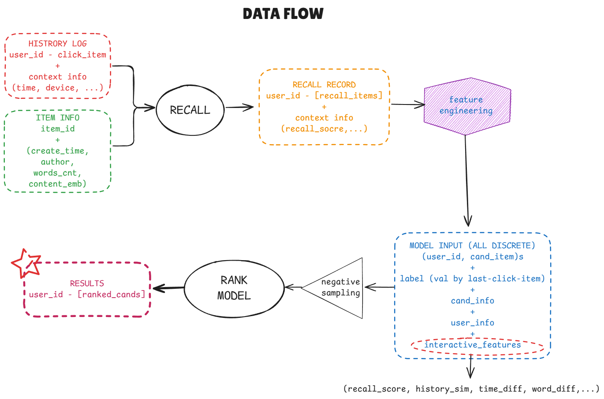

<div style="text-align: center;">
  
</div>

# News Recommendation System

> a practice project for Recommendation System, Deep Learning and ~~Python OOP~~

## Data

See [Tianchi](https://tianchi.aliyun.com/competition/entrance/531842/information) for the dataset used here, including:

* articles_emb.csv
* articles.csv
* train_click_log.csv
* testA_click_log.csv

| Stage                   | Metric              | Count     | Note                                                  |
| ----------------------- | ------------------- | --------- | ----------------------------------------------------- |
| **Raw Data**      | Total Users         | 250,000   |                                                       |
|                         | Total Articles      | 364,047   |                                                       |
|                         | Train Clicks        | 1,112,623 | Historical user-article interactions                  |
|                         | Train Users         | 200,000   |                                                       |
|                         | Test Clicks         | 518,010   | Historical user-article interactions                  |
|                         | Test Users          | 50,000    | No overlap with Train Users                           |
| **Recall Stage**  | Candidates per User | 30        | Top-K items from recall methods (ItemCF + YouTubeDNN) |
|                         | Total Recall Pairs  | 7,500,000 |                                                       |
| **Ranking Stage** | Training Samples    | 675,653   | After negative sampling (10:1 ratio)                  |
|                         | Validation Samples  | 169,037   | After negative sampling (10:1 ratio)                  |

## Overall

### Workflow


Mainly consists of two stages: Recall and Rank. Performing feature engineering based on the recall results.

**In RECALL stage**, I implement two methods:

* **ItemCF**: Item-based Collaborative Filtering
* **YouTube DNN**: Deep Neural Network model reproduced from [Deep Neural Networks for YouTube Recommendations
  ](https://static.googleusercontent.com/media/research.google.com/zh-CN//pubs/archive/45530.pdf) by Google.

I also add the cold start strategy for new users based on popular articles.

**In RANK stage**, I implement the DIN model to re-rank the candidates from RECALL stage. Here I reproduce the DIN model based on the paper [Deep Interest Network for Click-Through Rate Prediction](https://dl.acm.org/doi/abs/10.1145/3219819.3219823) by Alibaba.

> Crrently, the RANK stage only supports DIN model. Maybe more models will be added in the future. Then the stacking startegy can be applied to generate better results.

### Data flow



## Usage

### Requirements

See `pyproject.toml` for the required packages. I recommend using conda to manage the `Faiss` module for vector similarity search.

### Running the full pipeline

```bash
# Full pipeline (recall + ranking)
python main.py --mode full --offline --epochs 5

# Only recall stage
python main.py --mode recall

# Only ranking stage (assumes recall results exist)
python main.py --mode rank --offline --epochs 5

# Custom hyperparameters
python main.py --mode full \
    --epochs 10 \
    --batch-size 512 \
    --learning-rate 0.0005 \
    --embedding-dim 64 \
    --num-workers 8 \
    --negative-ratio 15 \
    --top-k 20
```

## Project Structure

```
root/
│
├── main.py                      
│
├── data/                        
│   ├── raw/                         # Raw input data
│   │   ├── articles_emb.csv         # Article embeddings
│   │   ├── articles.csv             # Article metadata
│   │   ├── train_click_log.csv      # Training click logs
│   │   └── testA_click_log.csv      # Test click logs
│   └── processed/                   # Processed data outputs (not used here)
│
└── src/                             # Source code
    ├── __init__.py
    │
    ├── data/                        # Data loading and processing
    │   ├── __init__.py
    │   ├── loaders.py               # Data loading utilities
    │   └── extractors.py            # Feature extraction utilities
    │
    ├── similarity/                  # Similarity computation
    │   ├── __init__.py
    │   ├── base.py                  # Base similarity class
    │   ├── item_cf.py               # Item-based CF similarity
    │   ├── user_cf.py               # User-based CF similarity
    │   └── embedding.py             # Embedding-based similarity
    │
    ├── recall/                      # Recall stage methods
    │   ├── __init__.py
    │   ├── base.py                  # Base recaller interface
    │   ├── itemcf_recaller.py       # ItemCF recall method
    │   ├── usercf_recaller.py       # UserCF recall method
    │   ├── youtubednn_recaller.py   # YouTubeDNN recall method
    │   ├── coldstart_recaller.py    # Cold start strategy
    │   └── fusion.py                # Multi-recall fusion
    │
    ├── features/                    # Feature engineering
    │   ├── __init__.py
    │   └── feature_extractor.py     # Main feature extractor
    │
    ├── rank/                        # Ranking stage models
    │   ├── __init__.py
    │   ├── base.py                  # Base ranker interface
    │   └── DIN.py                   # Deep Interest Network model
    │   
    │
    ├── pipeline/                    # End-to-end pipelines
    │   ├── recall_pipeline.py       # Recall stage pipeline
    │   ├── rank_pipeline.py         # Ranking stage pipeline
    │   └── features_pipeline.py     # Feature extraction pipeline
    │
    └── utils/                       # Utility modules
        ├── __init__.py
        ├── config.py                # Configuration classes
        ├── persistence.py           # File I/O utilities
        └── weights.py               # Weight calculation utilities
```

## Performance
* System: Ubuntu 24.04.3 LTS
* CPU: Intel Xeon Silver 4210R @ 2.4GHz
* GPU: NVIDIA RTX 4090 24GB; CUDA 12.4


* AUC-ROC: 0.9405
* Accuracy: 0.9201
* Precision: 0.6985
* Recall: 0.4683

## References

* 王喆. (2020). 深度学习推荐系统。电子工业出版社.
* [Deep Neural Networks for YouTube Recommendations](https://static.googleusercontent.com/media/research.google.com/zh-CN//pubs/archive/45530.pdf)
  
* [Deep Interest Network for Click-Through Rate Prediction](https://dl.acm.org/doi/abs/10.1145/3219819.3219823).
  
